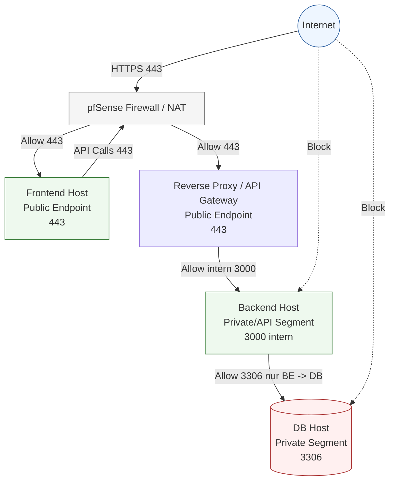

# Netzwerk Plan

_Stand: 2026-03-05_

## Ziel
Einfache visuelle Referenz für Netzwerkzonen, pfSense-Regeln und erlaubte Verbindungen.

## Netzwerkdiagramm

## Beispiel-Regelmatrix
| Quelle | Ziel | Port | Aktion | Zweck |
|---|---|---:|---|---|
| Internet | Frontend | 443 | Allow | UI erreichbar |
| Internet | Reverse Proxy/API-Gateway | 443 | Allow | API öffentlich via TLS |
| Frontend | Reverse Proxy/API-Gateway | 443 | Allow | API-Aufrufe |
| Reverse Proxy/API-Gateway | Backend | 3000 | Allow (intern) | interne API-Weiterleitung |
| Backend | Datenbank | 3306 | Allow | Datenbankzugriff |
| Internet | Backend | 3000 | Deny | kein direkter Node-Zugriff |
| Internet | Datenbank | 3306 | Deny | DB nicht öffentlich |

## pfSense-/Security-Checkliste
- [ ] Inbound nur notwendige Ports offen
- [ ] DB-Port extern nicht erreichbar
- [ ] API ohne Token/API-Key liefert 401/403
- [ ] Request- und Error-Logging aktiv
- [ ] Portweiterleitungen vollständig dokumentiert
